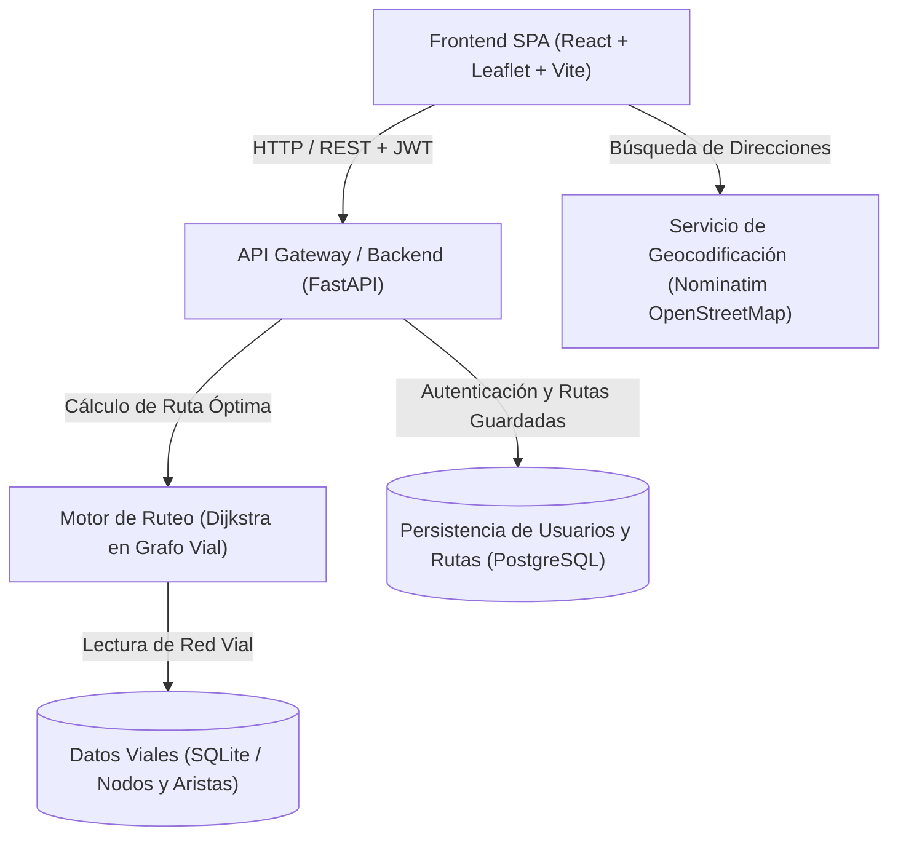

# Plan Vial - Motor de Ruteo Urbano y Grafos Geoespaciales

[](https://fastapi.tiangolo.com/)
[](https://react.dev/)
[](https://www.docker.com/)
[](https://opensource.org/licenses/MIT)

**Plan Vial** es una plataforma de análisis y planificación de rutas urbanas basada en teoría de grafos. Permite modelar redes viales completas de ciudades chilenas, calcular trayectorias óptimas utilizando el algoritmo de **Dijkstra**, y gestionar usuarios con autenticación JWT para persistir y compartir rutas.

> 🚀 **Demo en Vivo:** [planvial.onrender.com](https://planvial.onrender.com/)

---

## 🏛️ Arquitectura del Sistema

El sistema implementa una arquitectura desacoplada donde el motor de cálculo de rutas y la persistencia de usuarios operan de forma modular:



---

## 💡 Desafíos de Ingeniería Resueltos

1. **Migración y Modernización Arquitectónica:**
   * El proyecto original operaba sobre una base de código monolítica en Java. Se realizó una refactorización completa hacia un backend ligero y de alto rendimiento en **FastAPI (Python)** y un frontend reactivo en **React**.
2. **Optimización del Algoritmo de Ruteo:**
   * Implementación de **Dijkstra con cola de prioridad (min-heap)** para procesar grafos urbanos densos con complejidad temporal $O((V + E) \log V)$.
3. **Persistencia Híbrida y Resiliencia:**
   * Soporte dual: SQLite embebido para el grafo estático y PostgreSQL en la nube para cuentas de usuario, sesiones y geometrías de rutas guardadas (`/r/:id`).
4. **Contenerización y Despliegue:**
   * Empaquetado multietapa mediante `Dockerfile` y orquestación con `docker-compose.yml`.

---

## 🛠️ Stack Tecnológico

* **Backend:** Python 3.11, FastAPI, Pydantic, SQLAlchemy, PyJWT, Passlib (bcrypt).
* **Frontend:** React, TypeScript, Leaflet / React-Leaflet, Tailwind CSS, Vite.
* **Bases de Datos:** PostgreSQL (Neon / Render), SQLite.
* **Infraestructura:** Docker, Docker Compose, Render PaaS.

---

## 🚀 Instalación y Ejecución Local

### Prerrequisitos
* Docker y Docker Compose instalados (o Python 3.11+ y Node.js 18+).

### Opción 1: Con Docker Compose (Recomendado)
```bash
# 1. Clonar el repositorio
git clone https://github.com/rizzot0/plan-vial.git
cd plan-vial

# 2. Configurar variables de entorno
cp .env.example .env

# 3. Levantar la aplicación completa
docker compose up --build
```
La aplicación estará disponible en `http://localhost:8000`.

### Opción 2: Desarrollo Local sin Docker
```bash
# Backend
cd backend
python -m venv .venv
source .venv/bin/activate  # En Windows: .venv\Scripts\activate
pip install -r requirements.txt
uvicorn api.saas:app --reload --port 8000

# Frontend
cd ../frontend
npm install
npm run dev
```

---

## 📡 Endpoints Principales de la API

| Método | Endpoint | Descripción | Auth |
| :--- | :--- | :--- | :--- |
| `POST` | `/api/auth/register` | Registro de nuevos usuarios con hash bcrypt | Pública |
| `POST` | `/api/auth/login` | Autenticación y emisión de token Bearer JWT | Pública |
| `POST` | `/api/routes/calculate` | Cálculo de camino mínimo entre dos coordenadas | Pública / Opcional |
| `GET` | `/api/routes/saved` | Listado de rutas guardadas por el usuario | Requerida (JWT) |
| `GET` | `/api/routes/public/{id}` | Recuperación de geometría de ruta compartida | Pública |

---

## 👥 Autores
* **Bastian Guerra** ([@rizzot0](https://github.com/rizzot0)) - Arquitectura Backend, Integración y Contenerización.
* Ian Fernandez & Max Malebran - Colaboración en diseño y modelado de datos inicial.
